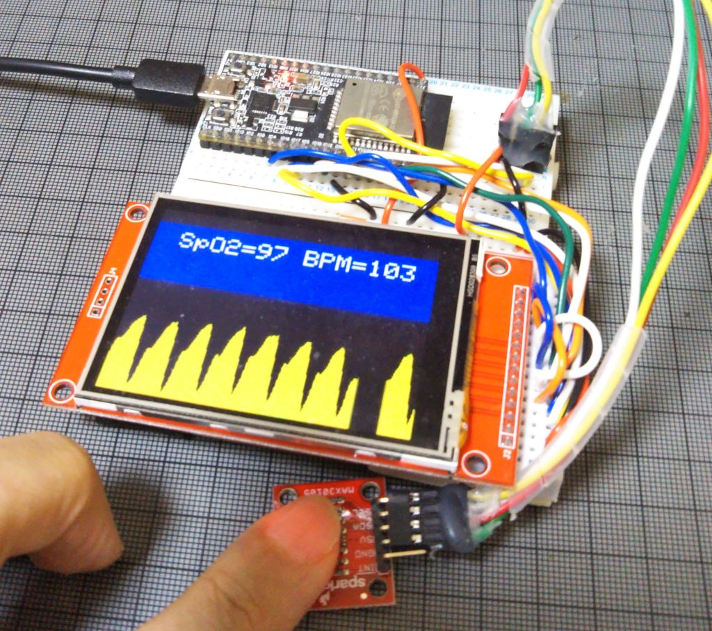

# Simple SpO2 plotter for MH-ET LIVE MAX30102 with BLE

Using Sparkfun MAX3010X library https://github.com/sparkfun/SparkFun_MAX3010x_Sensor_Library SpO2 is calulated from square root means of all raw data at 50Hz sampling speed, providing stable SpO2 values and shows SpO2 and the user's heart beat at the same time on Arduino's serial plotter.

This program sends SpO2 as a HRM(Heart Rate Monitor) of BLE standart service and smartphone application such as nRF Toolbox for BLE can display SpO2 as if it is a Heat Rate Monitor.

When 93bpm is displayed , it is 93% SpO2. not a Heart Rate!

Fig.1 SpO2 is displayed as HRM on nRF Toolbox for BLE


Shows SpO2(%) , Heart Rate(bpm) the user's heart beat by IR and RED LED on Arduino's serial plotter.
- No display hardware is required.
- This program does not need large 32bit buffer, calculates SpO2 on the fly. (no SpO2 data from the library)
- This program should not be used for medical purposes !
- I wrote this to learn how SpO2 can be measured and pay tributes for the inventors.

works with Sparkfun MAX3010X library
  https://github.com/sparkfun/SparkFun_MAX3010x_Sensor_Library
  
## What's new
- Sparkfun's MAX30105 board is supported, use #define MAX30105
- Heart Rate monitor is displayed on Arduino serial plotter.
- https://youtu.be/NfxGxCVRop4

optional hardwares if you like
- LED indicator on GPIO_15 , LED connected to GPIO_15 via pull down resister.(3.3kOhm for ex.)
- BEEP piezo speaker on GPIO_12
- if GPIO_4 is connected to ground, Heart rate will be sent to BLE/HRM.  

## Tips:
- Used argorithm

  DC component of IR and RED data (average) is calculated by digital low pass filter and subtracted from raw data to get AC components.
  Then, square root means of AC component of RED and IR are calculated for every 100 samples.

  SpO2 is calculated as 
```  
  R=((square root means of RED/ RED average )/((square root means of IR)/IR average)) 
  
  SpO2 = -23.3 * (R - 0.4) + 100
```  
The last formula is read from the graph in https://ww1.microchip.com/downloads/en/Appnotes/00001525B.pdf
or https://ww1.microchip.com/downloads/jp/AppNotes/00001525B_JP.pdf
  


- when IR signal is smaller than 30000 (#define FINGER_ON 30000), then SpO2 becomes 80 to indicate your finger is not on the sensor.

- Since MH-ET LIVE MAX30102 breakout board seems outputting IR and RED swapped when Sparkfun's library is used.
```C
red = particleSensor.getFIFOIR();
ir = particleSensor.getFIFORed();
```
  is used in my code. If you have Sparkfun's MAX30105 breakout board , try #define MAX30105
  (uncomment //#define MAX30105 )


Fig.2 SpO2(%) and HRM(bpm) are displayed on Arduino serial plotter


Fig.3 ESP32 and MH-ET LIVE MAX30102


Fig.4 ESP32 and ILI9341 display (use #define TFT_DISPLAY  using TFT_eSPI library )


### LICENSED under Apache License 2.0

## References
- nRF Toolbox for BLE https://play.google.com/store/apps/details?id=no.nordicsemi.android.nrftoolbox
- https://en.wikipedia.org/wiki/Oxygen_saturation_(medicine)
- https://en.wikipedia.org/wiki/Pulse_oximetry
- https://ethw.org/Takuo_Aoyagi
- #316 Pulse Oximeter test, function, and usage
  https://www.youtube.com/watch?v=fsJjHEnlQkU
- BLE Oximeter Hack with ESP32 for COVID-19 Projects
  https://www.youtube.com/watch?v=FIVIPHrAuAI
- ATTiny85 Pulse Oximeter with Photoplethysmogram (PPG) display
  https://github.com/jeffmer/tinyPulsePPG
- MAX30102 datasheet
  https://datasheets.maximintegrated.com/en/ds/MAX30102.pdf
- Recommended Configurations and Operating Profiles
  for MAX30101/MAX30102 EV Kits
  https://pdfserv.maximintegrated.com/en/an/AN6409.pdf
- Pulse Oximeter Design Using Microchip's Analog Devices and dsPIC Digital Signal Controllers (DSCs)
  https://ww1.microchip.com/downloads/en/Appnotes/00001525B.pdf
