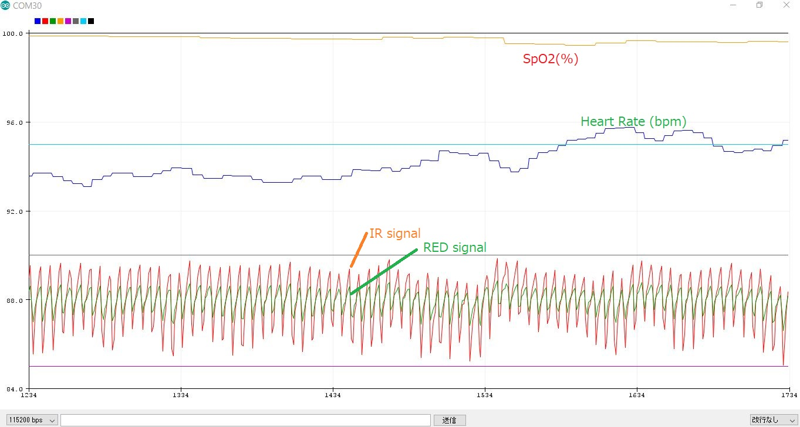
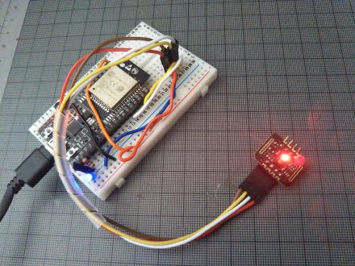

# Simple SpO2 plotter for MH-ET LIVE MAX30102 with BLE

SpO2 for Heart rate monitor application on smartphone.
This program sends SpO2 as a HRM(Heart Rate Monitor) of BLE standart service and smartphone application such as nRF Toolbox for BLE can display SpO2 as if it is a Heat Rate Monitor.

When 93bpm is displayed , it is 93% SpO2. not a Heart Rate!

Fig.1 SpO2 is displayed as HRM on nRF Toolbox for BLE

Shows SpO2(%) , Heart Rate(bpm) the user's heart beat by IR and RED LED on Arduino's serial plotter.
- No display hardware is required.
- This program does not need large 32bit buffer, caliculates SpO2 on the fly.
- This program should not be used for medical purposes !
- I wrote this to learn how SpO2 can be measured and pay tributes for the inventors.

works with Sparkfun MAX3010X library
  https://github.com/sparkfun/SparkFun_MAX3010x_Sensor_Library
  
## What's new
- Heart Rate monitor is displayed on Arduino serial plotter.

optional hardwares if you like
- LED indicator on GPIO_15 , LED connected to GPIO_15 via pull down resister.(3.3kOhm for ex.)
- BEEP piezo speaker on GPIO_12
 

Fig.2 SpO2(%) and HRM(bpm) are displayed on Arduino serial plotter

Fig.3 ESP32 and MH-ET LIVE MAX30102

### LICENSED under Apache License 2.0

## References
- nRF Toolbox for BLE https://play.google.com/store/apps/details?id=no.nordicsemi.android.nrftoolbox