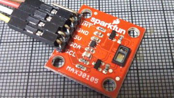

# Simple SpO2 plotter for MH-ET LIVE MAX30102
Using Sparkfun MAX3010X library
  https://github.com/sparkfun/SparkFun_MAX3010x_Sensor_Library
SpO2 is calulated from square root means of all raw data at 50Hz sampling speed, providing stable SpO2 values and
shows SpO2 and the user's heart beat at the same time on Arduino's serial plotter.
- No display hardware is required.
- This program does not need large 32bit buffer, caliculates SpO2 on the fly. (no SpO2 data from the library)
- This program should not be used for medical purposes !
- I wrote this to learn how SpO2 can be measured and pay tributes for the inventors.
- ESP32 BLE version is available. 
  https://github.com/coniferconifer/ESP32_MAX30102_simple-SpO2_plotter/tree/master/ESP32_MAX30102_simple-SpO2_plotter-BLE

  https://www.youtube.com/watch?v=NfxGxCVRop4

## What's new
 Sparkfun's MAX30105 board is supported. (May 19, 2020)
 use #define MAX30105
   
Fig.1 SpO2 at boot time


Fig.2 SpO2 drops by breath holding


## about SpO2 and pulse oximeter
  Peripheral oxygen saturation (SpO2) is an estimation of the oxygen saturation level usually measured with a pulse oximeter device.
- https://en.wikipedia.org/wiki/Oxygen_saturation_(medicine)
- https://en.wikipedia.org/wiki/Pulse_oximetry

  Pulse oximetry was developed in 1972, by Dr.Takuo Aoyagi and Michio Kishi, bioengineers, at Nihon Kohden in Japan.

- https://ethw.org/Takuo_Aoyagi
- https://www.google.com/search?client=firefox-b-d&q=Dr.Aoyagi+SpO2

Fig.3 MH-ET LIVE MAX30102 breakout board


## Tips:
- Used argorithm

  DC component of IR and RED data (average) is calculated by digital low pass filter and subtracted from raw data to get AC components.
  Then, square root means of AC component of RED and IR are calculated for every 100 samples.

  SpO2 is calculated as 
```  
  R=((square root means of RED/ RED average )/((square root means of IR)/IR average)) 
  
  SpO2 = -23.3 * (R - 0.4) + 100
```  
  The last formula is read from the graph in https://ww1.microchip.com/downloads/en/Appnotes/00001525B.pdf
  or https://ww1.microchip.com/downloads/jp/AppNotes/00001525B_JP.pdf
  
  
  

- when IR signal is smaller than 30000 (#define FINGER_ON 30000), then SpO2 becomes 80 to indicate your finger is not on the sensor.

- Since MH-ET LIVE MAX30102 breakout board seems outputting IR and RED swapped when Sparkfun's library is used.
```C
red = particleSensor.getFIFOIR();
ir = particleSensor.getFIFORed();
```
  is used in my code. If you have Sparkfun's MAX30105 breakout board , use #define MAX30105
  
Fig.4 insulating MAX30102 breakout board  


## Instructions:

  0) Install Sparkfun's MAX3010X library
  1) Load the code onto ESP32 with MH-ET LIVE MAX30102 board
  2) Put MAX30102 board in a plastic bag , insulating from your finger
     and attach the sensor to your finger tip
  3) Run this program by pressing reset botton on ESP32 devkitC
  4) Wait for 3 seconds and Open Arduino IDE Tools->'Serial Plotter'
     Make sure the drop down is set to 115200 baud
  5) Search the best position and pressure for the sensor by watching
     the blips on Arduino's serial plotter.
     I recommend to place LED under the backside of nail , wrap you
     finger and the sensor by rubber band softly.
  6) Checkout the SpO2 and blips by seeing serial plotter.
     100%,95%,90%,85% SpO2 lines are always drawn on the plotter

## Hardware Connections (Breakout board to ESP32 Arduino):
```
  -VIN = 3.3V
  -GND = GND
  -SDA = 21 (or SDA)
  -SCL = 22 (or SCL)
  -INT = Not connected
```  

## Hardware Connections (Breakout board to Arduino nano): 
  this script also works on Arduino nao.(experimental)
```
  -VIN = 3.3V 
  -GND = GND
  -SDA = A4 (or SDA)
  -SCL = A5 (or SCL)
  -INT = Not connected
```
## Trouble Shooting:
  Make sure to solder jumper on 3V3 side. 
  If you forget this, I2C does not work and can not find MAX30102, 
  says
```
 "MAX30102 was not found. Please check wiring/power/solder jumper."
```
  




### LICENSED under Apache License 2.0

## References
- #316 Pulse Oximeter test, function, and usage
  https://www.youtube.com/watch?v=fsJjHEnlQkU
- BLE Oximeter Hack with ESP32 for COVID-19 Projects
  https://www.youtube.com/watch?v=FIVIPHrAuAI
- ATTiny85 Pulse Oximeter with Photoplethysmogram (PPG) display
  https://github.com/jeffmer/tinyPulsePPG
- MAX30102 datasheet
  https://datasheets.maximintegrated.com/en/ds/MAX30102.pdf
- Recommended Configurations and Operating Profiles
  for MAX30101/MAX30102 EV Kits
  https://pdfserv.maximintegrated.com/en/an/AN6409.pdf
- Pulse Oximeter Design Using Microchip's Analog Devices and dsPIC Digital Signal Controllers(DSCs)
  https://ww1.microchip.com/downloads/en/Appnotes/00001525B.pdf

  
