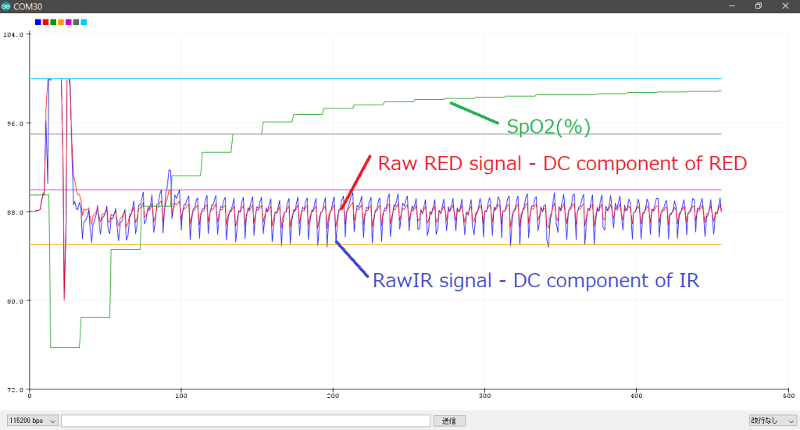
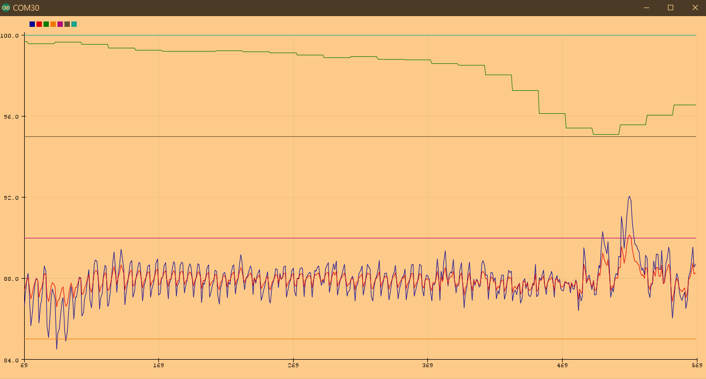
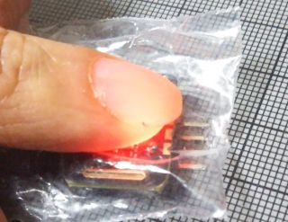
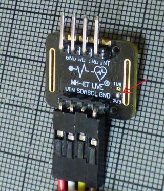
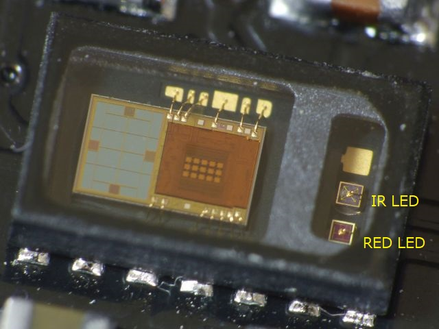

# Simple SpO2 plotter for MH-ET LIVE MAX30102
Using Sparkfun MAX3010X library
  https://github.com/sparkfun/SparkFun_MAX3010x_Sensor_Library

Shows SpO2 and the user's heart beat on Arduino's serial plotter.
- No display hardware is required.
- This program does not need large 32bit buffer, caliculates SpO2 on the fly.
- This program should not be used for medical purposes !
- I wrote this to learn how SpO2 can be measured and pay tributes for the inventors.

Fig.1 SpO2 at boot time


Fig.2 SpO2 by breath taking


## about SpO2 and pulse oximeter
  Peripheral oxygen saturation (SpO2) is an estimation of the oxygen saturation level usually measured with a pulse oximeter device.
- https://en.wikipedia.org/wiki/Oxygen_saturation_(medicine)
- https://en.wikipedia.org/wiki/Pulse_oximetry

  Pulse oximetry was developed in 1972, by Dr.Takuo Aoyagi and Michio Kishi, bioengineers, at Nihon Kohden in Japan.

- https://ethw.org/Takuo_Aoyagi

Fig.3 MH-ET LIVE MAX30102 breakout board


## Tips:
- used formula

  SpO2 is calicurated as 
```  
  R=((square root means of RED/ RED average )/((square root means of IR)/IR average)) 
  SpO2 = -23.3 * (R - 0.4) + 100
```  
  taken from a graph in http://ww1.microchip.com/downloads/jp/AppNotes/00001525B_JP.pdf

- when IR signal is smaller than 30000 , then SpO2 becomes 80 to indicate your finger is not on the sensor.

- Since MH-ET LIVE MAX30102 breakout board seems outputting IR and RED swapped when Sparkfun's library is used.
```C
red = particleSensor.getFIFOIR();
ir = particleSensor.getFIFORed();
```
  is used in my code. If you have Sparkfun's MAX30105 breakout board , try to
  correct these lines. 
  
Fig.4 insulating MAX30102 breakout board  



## Instructions:

  0) Install Sparkfun's MAX3010X library
  1) Load code onto ESP32 with MH-ET LIVE MAX30102 board
  2) put MAX30102 board in plastic bag , insulating from your finger
     and attach sensor to your finger tip
  3) Run this program by pressing reset botton on ESP32
  4) Wait for 3 seconds and Open Arduino IDE Tools->'Serial Plotter'
     Make sure the drop down is set to 115200 baud
  5) Search the best position and pressure for the sensor by watching
     the blips on Arduino's serial plotter.
     I recommend to place LED under the backside of nail , wrap you
     finger and the sensor by rubber band softly.

  5) Checkout the SpO2 and blips by seeing serial plotter.
     100%,95%,90%,85% SpO2 lines are always drawn on the plotter

## Hardware Connections (Breakoutboard to ESP32 Arduino):
```
  -VIN = 3.3V
  -GND = GND
  -SDA = 21 (or SDA)
  -SCL = 22 (or SCL)
  -INT = Not connected
```
## Trouble Shooting:
  Make sure to solder jumper on 3V3 side. 
  If you forget this, I2C does not work and can not find MAX30102, 
  says
```
 "MAX30102 was not found. Please check wiring/power/solder jumper."
```
  


### LICENSED under Apache License 2.0

## References
- #316 Pulse Oximeter test, function, and usage
  https://www.youtube.com/watch?v=fsJjHEnlQkU
- BLE Oximeter Hack with ESP32 for COVID-19 Projects
  https://www.youtube.com/watch?v=FIVIPHrAuAI
- ATTiny85 Pulse Oximeter with Photoplethysmogram (PPG) display
  https://github.com/jeffmer/tinyPulsePPG
- MAX30102 datasheet
  https://datasheets.maximintegrated.com/en/ds/MAX30102.pdf
- Recommended Configurations and Operating Profiles
  for MAX30101/MAX30102 EV Kits
  https://pdfserv.maximintegrated.com/en/an/AN6409.pdf

  
